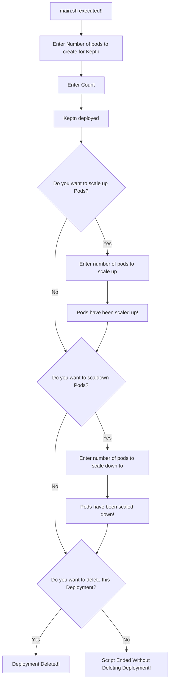

# Deploy-Keptn-Using-K8s
The Keptn project began as a way to assist enterprises in adopting cloud-native strategies for either cutting-edge microservice applications or long-standing monoliths. This ecosystem has been evolving since its inception, focusing on robust continuous delivery with automated testing, quality gates, and auto-remediation capabilities. It now has over 50.

## Pre-Requisites:
Kubctl with atleast one node should be present. OR Minikube should be installed.

## Workings steps to Deploy Keptn with Replication Controller:

- Deploy keptn rs with (default 3 replicas) following command.
```
kubectl create -f keptn-rs.yaml
```

- Get output of running pods using this command.
```
kubectl get po -o wide
```

- Scale Up / Scale Down the pods using this command.
```
kubectl scale rs keptn-rs --replicas=5
kubectl scale rs keptn-rs --replicas=1
```

- Delete keptn-rc after deployment
```
kubectl delete -f keptn-rs.yaml
```
**Note** Also there is a file main.sh that does all the above steps for you :relaxed:

## Executions steps
Just execute the main.sh file using this command. Rest script will handle everything :relaxed:

```
bash main.sh
```

## Flow of Deployment:


## Screenshots of Deployment
- Screenshot for Scale Up deployment


- Screenshot for Scale Down deployment
